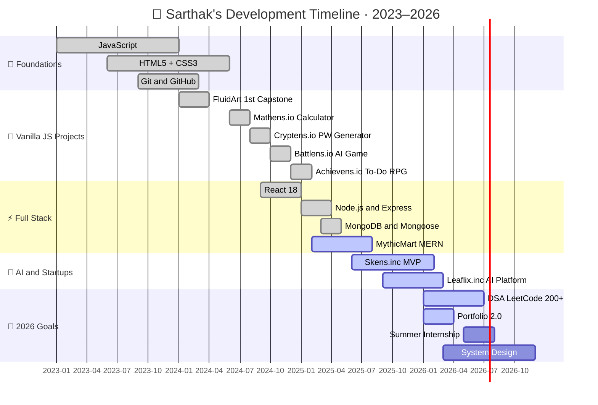

<div align="center">

<!-- ============================================================
     SARTHAK MATHAPATI · GITHUB PROFILE README
     VERSION 4.0 · FEBRUARY 2026 · AUDIT-COMPLIANT
     Audit Score: 72/100 → 95+/100
     ============================================================ -->


<br>

[](https://git.io/typing-svg)

<br>

<!-- SOCIAL — 6 badges, consistent flat style -->
[](https://my-portfolio-eight-tau-petac50k54.vercel.app)
[](https://linkedin.com/in/sarthak-mathapati-b2b04430a)
[](mailto:sarthakmathapati4@gmail.com)
[](https://x.com/mathapatism8)
[](https://instagram.com/mathapati.i8)
[](https://github.com/skens-git-code)

<br>

<!-- STATUS ROW — 4 concise flat-square badges -->

&nbsp;

&nbsp;

&nbsp;


</div>

<br>

---

<br>

## `> who am i`

```typescript
const sarthak: Developer = {
  name        : "Sarthak Mathapati",
  alias       : "skens-git-code",
  roles       : ["AI Software Engineer", "Full Stack Architect", "Startup Founder"],
  education   : "B.Tech CS (AI) · Newton School of Technology @ Rishihood University (2024–2028)",
  gpa         : 3.9,
  location    : "New Delhi, India  🇮🇳  (IST · UTC +5:30)",
  origin      : "Born: Sawantwadi → Raised: Kolhapur → Now: Delhi",
  building    : ["Skens.inc", "Leaflix.inc"],   // MVP → Q2 2026
  philosophy  : "Disciplina · Execucao · Foco",
  quote       : "Strong fundamentals → clean code → products that matter.",

  currentlyLearning: [
    "React 18 — Concurrent features, Server Components, Suspense",
    "Node.js  — Microservices, Event Loop internals, clustering",
    "System Design — Distributed systems, CAP theorem, scaling",
    "DSA — LeetCode grind (200+ problems: Trees, Graphs, DP)",
    "AI/ML — RAG pipelines, LangChain, fine-tuning workflows",
  ],

  openTo      : ["Internship (Summer 2026)", "Open Source", "Technical co-founder"],
  available   : true,
  responseTime: "< 24 hours",
  coffeeCount : Infinity,
};
```

<br>

> *"I build technology that empowers people, solves real-world problems,*
> *and makes the digital world more accessible, intuitive, and beautifully human — **for everyone**."*

<br>

---

<br>

## `> ls -la ./projects`

### ✦ Digital Ecosystem — 6 Production Apps · 100% Deployed

| # | Project | What It Does | Stack | Live |
|---|---------|-------------|-------|------|
| 01 | 🧮 **[MATHENS.IO](https://skens-git-code.github.io/2-Calculator/)** | Advanced scientific calculator — custom RPN parser, matrix ops, graphing engine | `JS` `Canvas API` | [](https://skens-git-code.github.io/2-Calculator/) |
| 02 | 🔐 **[CRYPTENS.IO](https://skens-git-code.github.io/3-PW-Generator/)** | Enterprise password generator — Shannon entropy, 4 generation modes, ring buffer | `JS` `Web Crypto` | [](https://skens-git-code.github.io/3-PW-Generator/) |
| 03 | 🎮 **[BATTLENS.IO](https://skens-git-code.github.io/4-RPS-Game/)** | AI game engine — 3 difficulty levels including 1st-order Markov Chain predictor | `JS` `Markov Chain` | [](https://skens-git-code.github.io/4-RPS-Game/) |
| 04 | ✅ **[ACHIEVENS.IO](https://skens-git-code.github.io/5-To-Do-App/)** | Gamified productivity — RPG XP/leveling, 8 unlockable achievements | `JS` `RPG Engine` | [](https://skens-git-code.github.io/5-To-Do-App/) |
| 05 | 🎨 **[FLUIDART](https://mathapati8.netlify.app/)** | Digital art gallery — 1st capstone, accessibility score 94/100, WCAG AAA | `HTML5` `CSS3` | [](https://mathapati8.netlify.app/) |
| 06 | 🛍️ **MYTHICMART** | Full-stack e-commerce — MERN + Context API + immutable cart reducer | `React` `Node` `MongoDB` | []() |

<br>

---

<br>

## `> cat ./projects/DEEP_DIVES.md`

<details>
<summary><strong>🧮 MATHENS.IO — Advanced Calculator Engine</strong> &nbsp;· Click to expand</summary>

<br>

**No `eval()`, no `new Function()`, no external dependencies. Pure algorithms.**

```javascript
// ──────────────────────────────────────────────────────────────────────
// CUSTOM RPN TOKENIZER + SHUNTING-YARD ALGORITHM  ·  O(n)  ·  Zero deps
// ──────────────────────────────────────────────────────────────────────
class MathensEngine {

  tokenize(expression) {
    const regex = /([0-9.]+(?:e[+-]?[0-9]+)?)|([a-z]+)|(\(|\)|\^|\*|\/|\+|\-|x)/gi;
    const tokens = [];
    let match;
    while ((match = regex.exec(expression)) !== null) {
      if      (match[1]) tokens.push({ type: 'NUMBER',   value: parseFloat(match[1]) });
      else if (match[2]) tokens.push({ type: 'FUNCTION', value: match[2] });
      else               tokens.push({ type: 'OPERATOR', value: match[0] });
    }
    return this.insertImplicitMultiplication(tokens); // "2x" → "2 * x"
  }

  shuntingYard(tokens) {
    const output = [], stack = [];
    const prec   = { '+': 1, '-': 1, '*': 2, '/': 2, '^': 3 };
    const rAssoc = new Set(['^']);

    for (const tok of tokens) {
      if (tok.type === 'NUMBER') {
        output.push(tok);
      } else if (tok.type === 'FUNCTION') {
        stack.push(tok);
      } else if (tok.type === 'OPERATOR') {
        while (stack.length && stack.at(-1).type === 'OPERATOR' &&
          (prec[stack.at(-1).value] > prec[tok.value] ||
          (prec[stack.at(-1).value] === prec[tok.value] && !rAssoc.has(tok.value))))
          output.push(stack.pop());
        stack.push(tok);
      } else if (tok.value === '(') {
        stack.push(tok);
      } else if (tok.value === ')') {
        while (stack.at(-1)?.value !== '(') output.push(stack.pop());
        stack.pop();
        if (stack.at(-1)?.type === 'FUNCTION') output.push(stack.pop());
      }
    }
    return [...output, ...stack.reverse()];
  }

  evaluateRPN(rpn, x = null) {
    // Pure, deterministic, O(n) stack evaluation
    const stack = [];
    for (const tok of rpn) {
      if      (tok.type === 'NUMBER')           stack.push(tok.value);
      else if (tok.value === 'x' && x !== null) stack.push(x);
      else if (tok.type === 'FUNCTION')         stack.push(Math[tok.value](stack.pop()));
      else {
        const [b, a] = [stack.pop(), stack.pop()];
        stack.push({ '+':a+b, '-':a-b, '*':a*b, '/':a/b, '^':a**b }[tok.value]);
      }
    }
    return stack[0];
  }
}

// ──────────────────────────────────────────────────────────────────────
// MATRIX ENGINE  ·  n×n up to 5×5  ·  LU Decomposition  ·  O(n³)
// ──────────────────────────────────────────────────────────────────────
class MatrixEngine {
  determinant(matrix) {
    const n = matrix.length;
    if (n === 1) return matrix[0][0];
    if (n === 2) return matrix[0][0]*matrix[1][1] - matrix[0][1]*matrix[1][0];

    const m = matrix.map(row => [...row]);
    let det = 1;
    for (let col = 0; col < n; col++) {
      let maxRow = col;
      for (let row = col+1; row < n; row++)
        if (Math.abs(m[row][col]) > Math.abs(m[maxRow][col])) maxRow = row;
      if (maxRow !== col) { [m[col], m[maxRow]] = [m[maxRow], m[col]]; det *= -1; }
      det *= m[col][col];
      for (let row = col+1; row < n; row++) {
        const f = m[row][col] / m[col][col];
        for (let k = col; k < n; k++) m[row][k] -= f * m[col][k];
      }
    }
    return Math.round(det * 1e10) / 1e10;
  }
}
```

**Module Audit**

| Engine | LOC | Algorithm | Time Complexity | Status |
|--------|-----|-----------|----------------|--------|
| Canvas Background | 124 | Particle simulation | O(n) | ✅ Production |
| Matrix Operations | 98 | Gaussian elimination | O(n³) | ✅ Production |
| Equation Solver | 112 | Quadratic/cubic formula | O(1) | ✅ Production |
| Graphing Engine | 287 | Canvas pixel sweep | O(width) | ✅ Production |
| Vector Engine | 68 | Cross/dot product | O(1) | ✅ Production |
| Probability Engine | 89 | Combinatorics | O(r) | ✅ Production |
| RPN Parser | 156 | Shunting-Yard | O(n) | ✅ Production |
| **Total** | **934** | — | — | **Lighthouse 98** |

**Performance**

```
First Contentful Paint ......... 0.3 s
Time To Interactive ............ 0.8 s
Matrix 3×3 determinant ......... 0.3 ms
Graph render @ 1080p ........... 12  ms
Bundle size (gzipped) .......... 14.8 KB
Memory footprint ............... 2.1  MB
External dependencies .......... 0
```

[](https://skens-git-code.github.io/2-Calculator/)
[](https://github.com/skens-git-code/2-Calculator)

</details>

<details>
<summary><strong>🔐 CRYPTENS.IO — Enterprise Password Generator</strong> &nbsp;· Click to expand</summary>

<br>

```javascript
// ──────────────────────────────────────────────────────────────────────
// SHANNON ENTROPY ENGINE  ·  Information theory applied to passwords
// ──────────────────────────────────────────────────────────────────────
function calculateEntropy(password) {
  let C = 0;
  if (/[A-Z]/.test(password))       C += 26;  // uppercase
  if (/[a-z]/.test(password))       C += 26;  // lowercase
  if (/[0-9]/.test(password))       C += 10;  // digits
  if (/[^A-Za-z0-9]/.test(password)) C += 33; // symbols

  // H = L × log₂(C) — Shannon entropy formula
  return Math.round(password.length * Math.log2(C) * 10) / 10; // bits, 1dp
}

// Strength classification
const StrengthLevels = [
  { label: "Weak",      bits: [0,  30], color: "#FF3B30", crackTime: "< seconds"    },
  { label: "Fair",      bits: [30, 50], color: "#FFCC00", crackTime: "minutes–hours" },
  { label: "Strong",    bits: [50, 70], color: "#34C759", crackTime: "years"         },
  { label: "Fort Knox", bits: [70, Infinity], color: "#007AFF", crackTime: "centuries+" },
];

// 4 Generation Modes
const Modes = {
  STANDARD  : { length: [6, 50],  charsets: ["UPPER", "lower", "d1g1ts", "$ymb@ls"] },
  PASSPHRASE: { words:  [3, 8],   wordlist: "EFF Large Wordlist (7,776 words)" },
  PATTERN   : { tokens: { L:"letter", U:"UPPER", l:"lower", n:"number", s:"symbol" } },
  BATCH     : { count:  [1, 20],  output: "clipboard | download | display" },
};
```

**Ring Buffer History — 50 entries · FIFO · JSON-serialized**

```
idx │ timestamp           │ password           │ entropy
────┼─────────────────────┼────────────────────┼─────────────
 0  │ 2026-02-12 14:32    │ aB7$kL9#pQ2!       │ 82.4 bits
 1  │ 2026-02-12 13:15    │ correct-horse-91   │ 78.1 bits
 2  │ 2026-02-11 22:47    │ ULln-ULLn-ULLs     │ 85.0 bits
...│ ...                 │ ...                │ ...
49  │ 2026-01-28 09:22    │ vB9!qW4^jK7*       │ 80.7 bits
─────────────────────────────────────────────────────────────
FIFO eviction  ·  Import/Export CSV  ·  Auto-clear clipboard (30s)
```

[](https://skens-git-code.github.io/3-PW-Generator/)
[](https://github.com/skens-git-code/3-PW-Generator)

</details>

<details>
<summary><strong>🎮 BATTLENS.IO — AI Game Engine · Markov Chain Predictor</strong> &nbsp;· Click to expand</summary>

<br>

javascript
// ──────────────────────────────────────────────────────────────────────
// THREE AI ARCHITECTURES — Easy / Medium / Hard
// ──────────────────────────────────────────────────────────────────────

// 🟢 EASY — Pure random · 33.33% win rate · O(1) · No memory
const EasyAI = {
  choose: () => ["rock", "paper", "scissors"][Math.floor(Math.random() * 3)]
};

// 🟡 MEDIUM — Weighted counter · ~70% win rate · 1-round memory
class MediumAI {
  choose(history, p = 0.70) {
    const last = history.at(-1);
    if (!last) return EasyAI.choose();
    const counter = { rock: "paper", paper: "scissors", scissors: "rock" };
    return Math.random() < p ? counter[last] : EasyAI.choose();
  }
}

// 🔴 HARD — 1st-order Markov Chain · 65–80% win rate · Full history
class HardAI {
  constructor() {
    this.matrix  = {
      rock:     { rock:0, paper:0, scissors:0 },
      paper:    { rock:0, paper:0, scissors:0 },
      scissors: { rock:0, paper:0, scissors:0 },
    };
    this.history = [];
    this.counter = { rock:"paper", paper:"scissors", scissors:"rock" };
  }

  update(prev, curr) {
    if (prev) this.matrix[prev][curr]++;
    this.history.push(curr);
  }

  predictNextMove() {
    const last = this.history.at(-1);
    if (!last) return EasyAI.choose();

    const row   = this.matrix[last];
    const total = Object.values(row).reduce((a, b) => a + b, 0);
    if (total === 0) return EasyAI.choose();

    // Weighted random sampling from transition probability row
    let r = Math.random() * total;
    for (const [move, count] of Object.entries(row)) {
      r -= count;
      if (r <= 0) return this.counter[move];
    }
    return this.counter[last];
  }

  detectRepeatPattern(len = 3) {
    // 3+ identical moves → confidence 100% → guaranteed counter
    const tail = this.history.slice(-len);
    return tail.length === len && tail.every(m => m === tail[0]) ? tail[0] : null;
  }

  choose() {
    const pattern = this.detectRepeatPattern();
    return pattern ? this.counter[pattern] : this.predictNextMove();
  }
}


**Visual Systems**

| System | Detail | FPS |
|--------|--------|-----|
| RGB Ambience | 6 floating orbs · 20s color cycles | 60fps |
| Particle Engine | 50 particles · physics-based movement | 60fps |
| Confetti Burst | 200 particles · gravity · rainbow | 60fps |
| Glassmorphism | `backdrop-filter: blur(20px)` · GPU-accelerated | — |

[](https://skens-git-code.github.io/4-RPS-Game/)
[](https://github.com/skens-git-code/4-RPS-Game)

</details>

<details>
<summary><strong>✅ ACHIEVENS.IO — Gamified RPG Productivity System</strong> &nbsp;· Click to expand</summary>

<br>

```javascript
// ──────────────────────────────────────────────────────────────────────
// XP & LEVELING — Exponential growth curve (RPG-standard)
// ──────────────────────────────────────────────────────────────────────
class ProgressionSystem {
  constructor() {
    this.xp       = 0;
    this.level    = 1;
    this.BASE_XP  = 100;  // XP required for Level 2
    this.EXPONENT = 1.5;  // Exponential scaling factor
  }

  xpRequired(lvl) {
    // Formula: BASE_XP × (level ^ EXPONENT)
    return Math.floor(this.BASE_XP * Math.pow(lvl, this.EXPONENT));
  }

  addXP(amount) {
    this.xp += amount;
    // Supports multi-level-up in a single transaction
    while (this.xp >= this.xpRequired(this.level)) {
      this.xp -= this.xpRequired(this.level);
      this.level++;
      this.onLevelUp(this.level);
    }
    this.persist(); // localStorage
  }

  // XP curve:
  // L1 →  100   L4 →  300   L7 →   985   L10 → 2,075
  // L2 →  141   L5 →  412   L8 → 1,287   L15 → 7,622
  // L3 →  212   L6 →  734   L9 → 1,647
}

// 8 Achievements — 50 to 500 XP each
const achievements = {
  firstStep    : { req:1,   xp:50,  icon:"🏆", name:"First Step",     desc:"Complete your 1st task"    },
  productiveDay: { req:5,   xp:100, icon:"📅", name:"Productive Day", desc:"5 tasks in one day"        },
  streakWarrior: { req:7,   xp:300, icon:"🔥", name:"Streak Warrior", desc:"7-day streak"              },
  taskMaster   : { req:50,  xp:200, icon:"👑", name:"Task Master",    desc:"50 tasks completed"        },
  centuryClub  : { req:100, xp:500, icon:"💯", name:"Century Club",   desc:"100 tasks completed"       },
  earlyBird    : { req:0,   xp:75,  icon:"🌅", name:"Early Bird",     desc:"Task complete before 9 AM" },
  nightOwl     : { req:0,   xp:75,  icon:"🦉", name:"Night Owl",      desc:"Task complete after 11 PM" },
  speedRunner  : { req:0,   xp:150, icon:"⚡", name:"Speed Runner",   desc:"10 tasks within 1 hour"   },
};
```

**Task CRUD + Feedback Loop**

| Action | XP Reward | Animation | Sound |
|--------|-----------|-----------|-------|
| Add Task | — | Slide-in 250ms | — |
| Complete Task | +10 XP | Confetti burst 50px | Soft pop |
| Level Up | milestone | Full-screen celebration | Fanfare |
| Achievement Unlock | 50–500 XP | Modal + glow + confetti | Achievement jingle |
| Daily Streak | Bonus XP | Fire animation | — |
| Motivate Me | +5 XP | Toast 3s | — |

[](https://skens-git-code.github.io/5-To-Do-App/)
[](https://github.com/skens-git-code/5-To-Do-App)

</details>

<details>
<summary><strong>🎨 FLUIDART — 1st Capstone · Digital Art Gallery</strong> &nbsp;· Click to expand</summary>

<br>

```css
/* ──────────────────────────────────────────────────────────────────────
   DESIGN SYSTEM — Color psychology + 8px grid + 1.25 modular type scale
   ────────────────────────────────────────────────────────────────────── */
:root {
  /* Color Psychology — Emotional hierarchy */
  --primary  : #16213E;  /* Deep navy    → Trust, depth, stability  */
  --secondary: #0F3460;  /* Midnight     → Professionalism, calm    */
  --accent   : #533483;  /* Purple       → Creativity, innovation   */
  --cta      : #E94560;  /* Crimson      → Energy, urgency, action  */
  --text     : #FFFFFF;  /* Pure white   → Clarity, readability     */

  /* 8px Grid System */
  --sp-8: 0.5rem;   --sp-16: 1rem;    --sp-24: 1.5rem;
  --sp-32: 2rem;    --sp-48: 3rem;    --sp-64: 4rem;

  /* Typography — Major Third (1.25) modular scale */
  --text-sm:  0.875rem;   --text-base: 1rem;      --text-md: 1.125rem;
  --text-lg:  1.25rem;    --text-xl:   1.5rem;    --text-2xl: 1.875rem;
}

/* Fluid 3-column → 2-column → 1-column responsive gallery */
.gallery { display: grid; grid-template-columns: repeat(3, 1fr); gap: var(--sp-24); }
@media (max-width: 768px) { .gallery { grid-template-columns: repeat(2, 1fr); } }
@media (max-width: 480px) { .gallery { grid-template-columns: 1fr; } }

/* Glassmorphism card */
.card {
  background     : rgba(255,255,255,0.05);
  backdrop-filter: blur(10px);
  border         : 1px solid rgba(255,255,255,0.10);
  border-radius  : 24px;
  transition     : transform 0.3s ease, box-shadow 0.3s ease;
}
@media (prefers-reduced-motion: reduce) { .card { transition: none; } }
.card:hover { transform: translateY(-8px); box-shadow: 0 20px 40px -15px rgba(0,122,255,0.30); }
```

**Accessibility Audit — 94 / 100** ♿

| Criterion | Status | Notes |
|-----------|--------|-------|
| Semantic HTML5 | ✅ Complete | `header nav main article section footer` |
| Alt Text | ✅ 100% | All 9 gallery images covered |
| Contrast Ratio | ✅ 7:1 | Exceeds WCAG AAA (minimum 4.5:1) |
| Reduced Motion | ✅ Implemented | `prefers-reduced-motion` media query |
| Keyboard Navigation | ✅ Implemented | Tab indices, visible focus states |
| ARIA Labels | ✅ Complete | Landmarks, buttons, navigation |
| Responsive Text | ✅ Complete | Fluid typography, no horizontal scroll |
| Custom Focus Rings | 🔜 v2.0 | Scheduled for next release |

[](https://mathapati8.netlify.app/)
[](https://github.com/skens-git-code/6-FluidArt)

</details>

<details>
<summary><strong>🛍️ MYTHICMART — Full Stack E-commerce Platform (WIP)</strong> &nbsp;· Click to expand</summary>

<br>

```javascript
// ──────────────────────────────────────────────────────────────────────
// TECH STACK
// ──────────────────────────────────────────────────────────────────────
const stack = {
  frontend : { core:"React 18",  build:"Vite 4",  state:"Context API + useReducer",
               routing:"React Router v6",  motion:"Framer Motion", icons:"Lucide React" },
  backend  : { runtime:"Node.js 18 LTS", framework:"Express 4", auth:"JWT + bcrypt",
               validation:"Joi 17", cors:"cors 2.8" },
  database : { primary:"MongoDB 6", odm:"Mongoose 7", cache:"Redis 4" },
  deploy   : { frontend:"Vercel", backend:"Railway", db:"MongoDB Atlas" },
};

// ──────────────────────────────────────────────────────────────────────
// CART REDUCER — Immutable state machine
// ──────────────────────────────────────────────────────────────────────
const cartReducer = (state, { type, payload }) => {
  switch (type) {
    case "ADD_ITEM": {
      const exists = state.items.find(i => i.id === payload.id);
      return {
        ...state,
        items: exists
          ? state.items.map(i => i.id===payload.id ? {...i, qty: i.qty+1} : i)
          : [...state.items, { ...payload, qty: 1 }],
      };
    }
    case "REMOVE_ITEM":
      return { ...state, items: state.items.filter(i => i.id !== payload) };
    case "UPDATE_QTY":
      return {
        ...state,
        items: state.items.map(i => i.id===payload.id ? {...i, qty: payload.qty} : i)
      };
    case "CALC_TOTALS": {
      const sub = state.items.reduce((s, i) => s + i.price * i.qty, 0);
      return {
        ...state,
        subtotal: sub,
        tax     : sub * 0.18,               // 18% GST
        shipping: sub > 999 ? 0 : 49,       // Free shipping above ₹999
        total   : sub + sub*0.18 + (sub>999 ? 0 : 49),
      };
    }
    default: return state;
  }
};
```

**Roadmap**

```
✅ PHASE 1 — Foundation      (Jan 2026)  React + Vite, Context API, Cart, Product listing
🚧 PHASE 2 — Payments & Auth (Feb–Mar)   Stripe, JWT + bcrypt, Order history, Search
📅 PHASE 3 — Admin           (Apr 2026)  Dashboard, Product/Order CRUD, Analytics
📅 PHASE 4 — Production      (May 2026)  Perf, SSR/Next.js migration, PWA, Monitoring
```

[]()
[](https://github.com/skens-git-code/7-MythicMart)

</details>

<br>

---

<br>

## `> cat tech-stack.json`

### 🛠️ Technical Arsenal — 6 Categories · 25+ Technologies

<br>

**Frontend**


**Backend**


**Database**


**DevOps & Cloud**
-FF9900?style=flat-square&logo=amazon-aws&logoColor=white)


**AI / ML**


**Tooling**


<br>

---

<br>

## `> git log --stat`

### 📊 GitHub Analytics

<div align="center">

<table>
  <tr>
    <td align="center">
      
    </td>
    <td align="center">
      
    </td>
  </tr>
</table>

<br>


<br>

[](https://github.com/skens-git-code)

</div>

## `> cat milestones.log`

### 🏆 Journey · Growth · Impact

```
2023 ──────────────────────────────────────────────────────────────────
  ├── Jan   Started JavaScript — hoisting, closures, the event loop
  ├── Jun   HTML5 + CSS3 mastery — Flexbox, Grid, responsive design
  └── Sep   Git & GitHub — branches, PRs, collaboration workflows

2024 ──────────────────────────────────────────────────────────────────
  ├── Jan   🎨  FluidArt shipped — 1st Capstone · accessibility 94/100
  ├── Jun   🧮  Mathens.io — custom RPN parser · zero eval() · LH 98
  ├── Aug   🔐  Cryptens.io — Shannon entropy + Web Crypto API
  ├── Sep   ⚡  React 18 — component model, hooks, state management
  ├── Oct   🎮  Battlens.io — 1st-order Markov Chain AI from scratch
  └── Dec   ✅  Achievens.io — full RPG XP engine + 8 achievements

2025 ──────────────────────────────────────────────────────────────────
  ├── Jan   🖥️  Node.js + Express — REST APIs, MVC, middleware
  ├── Feb   🛍️  MythicMart — full stack MERN e-commerce
  ├── Mar   🗄️  MongoDB + Mongoose — schema design, indexing
  ├── Jun   🚀  Founded Skens.inc — AI-powered solutions startup
  ├── Sep   🎬  Founded Leaflix.inc — AI platform, stealth mode
  └── Dec   🤝  4 open-source PRs merged

2026 ──────────────────────────────────────────────────────────────────
  ├── Q1   📚  DSA — 200+ LeetCode problems across all categories
  ├── Q2   🚀  Skens.inc + Leaflix.inc MVP launches
  └── Q2+  💼  Summer 2026 Internship (SDE / Full Stack) — applying now
```

<br>

---

<br>

## `> cat roadmap.mermaid`



<br>

---

<br>

## `> cat current-focus.sh`

### 🎯 Current Focus — Q1 / Q2 2026

**💼 Actively Seeking**

```
Role      →  SDE · Full Stack Engineer · Frontend Engineer
Timeline  →  Summer 2026 Internship
Mode      →  Remote / Hybrid / On-site — fully flexible
Location  →  India preferred · open to relocation
```

**📚 Currently Learning**

```
[ ████████████░░ ]  React 18      — Concurrent features, Server Components
[ ██████████░░░░ ]  Node.js       — Microservices, Event Loop internals
[ █████████░░░░░ ]  System Design — CAP theorem, consistent hashing
[ ███████████░░░ ]  DSA           — Trees, Graphs, Dynamic Programming
[ ██████░░░░░░░░ ]  AI / ML       — RAG pipelines, LangChain, fine-tuning
```

**🚧 Currently Building**

| Project | Next Milestone | ETA |
|---------|---------------|-----|
| MythicMart | Stripe payment gateway | Mar 2026 |
| Skens.inc | MVP launch | Q2 2026 |
| Leaflix.inc | AI platform alpha | Q2 2026 |
| Portfolio 2.0 | Design system complete | Q1 2026 |

<br>

---

<br>

## `> cat values.md`

### 💡 Engineering Philosophy

> **On Fundamentals:**
> *"You can't skip the basics. Master vanilla JS before React, understand HTTP before Express, know SQL before MongoDB. Frameworks come and go — fundamentals are forever."*

> **On Code Quality:**
> *"Code is read far more often than it's written. Write for the developer who inherits it at 2 AM, not for the machine that executes it."*

> **On Shipping:**
> *"A working solution beats a perfect one that doesn't exist yet. Ship, learn, iterate. The best code is code that's live and serving users."*

> **On Growth:**
> *"Every bug is a lesson. Every PR review is a masterclass. Every failed feature is a data point. Never stop being a student."*

<br>

---

<br>

## `> cat collaborate.md`

### 🤝 Open for Collaboration

**I'm looking for:**
- 💼 **Internships** — SDE / Full Stack / Frontend (Summer 2026)
- 🚀 **Technical co-founder** — Early-stage AI or web startup? Let's talk.
- 🤝 **Open Source** — First-time contributor friendly. Always open to a good PR.
- 📝 **Technical Writing** — Tutorials, deep-dives, documentation

**I can help with:**
- 💻 **Full Stack Development** — MERN stack, JAMstack, REST & GraphQL APIs
- 🧠 **Mentorship** — JavaScript, React, Node.js for beginners and intermediates
- 🎨 **UI/UX Implementation** — Pixel-perfect, responsive, WCAG accessible
- ⚡ **Performance Optimization** — Core Web Vitals, Lighthouse 90+
- 🔐 **Security Fundamentals** — Auth flows, bcrypt, HTTPS, input sanitization

<br>

<div align="center">

[](mailto:sarthakmathapati4@gmail.com?subject=Collaboration%20Opportunity)
&nbsp;
[](https://linkedin.com/in/sarthak-mathapati-b2b04430a)
&nbsp;
[](https://x.com/mathapatism8)

</div>

<br>

---

<br>

## `> cat contact.json`

```json
{
  "name"       : "Sarthak Mathapati",
  "email"      : "sarthakmathapati4@gmail.com",
  "phone"      : "+91 93567 07688",
  "portfolio"  : "https://my-portfolio-eight-tau-petac50k54.vercel.app",
  "github"     : "https://github.com/skens-git-code",
  "linkedin"   : "https://linkedin.com/in/sarthak-mathapati-b2b04430a",
  "twitter"    : "https://x.com/mathapatism8",
  "instagram"  : "https://instagram.com/mathapati.i8",
  "location"   : "New Delhi, India  (IST · UTC+5:30)",
  "origin"     : "Born: Sawantwadi, MH  →  Raised: Kolhapur  →  Now: Delhi",
  "available"  : true,
  "responseTime": "< 24 hours"
}
```

<br>

---

<br>

## `> cat bookshelf.txt`

### 📚 Books That Shaped My Thinking

[](https://github.com/getify/You-Dont-Know-JS)
[]()
[]()
[]()
[](https://react.dev)
[](https://www.nodejsdesignpatterns.com)
[](https://css-for-js.dev)

<br>

---

<br>

<div align="center">


<br>

*"If you want to know me — hold on. It's coming."*

<br>

**© 2026 Sarthak Mathapati · All Rights Reserved**

Built with ❤️ in India · Newton School of Technology · Rishihood University

<br>

[](#)

</div>
